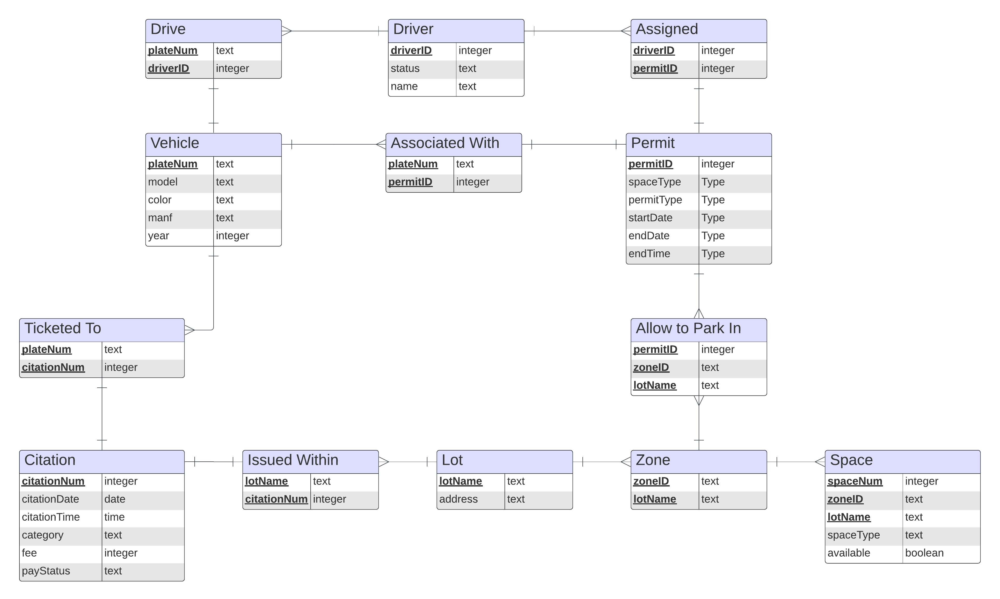

# Wolf Parking Management System

## Overview
The Wolf Parking Management System is a comprehensive database management system designed to efficiently manage NC State's parking system. This project was developed by a team of graduate students as part of a Database Management Systems course. The system provides functionalities for administrators, security personnel, and users to handle driver information, parking lot details, permits, vehicles, citations, and generate various reports.

## Database Schema

## Functionality
The different actions a user can take are divided into the following categories:
1. **Information Processing:**
   - Enter, update, or delete basic information about drivers, parking lots, zones, and spaces
   - Assign zones to parking lots, specify space types
   - Handle citation appeals and payment status updates

2. **Permits and Vehicle Information:**
   - Approve or deny permits
   - Enter, update, or delete information about vehicles and permits

3. **Generating Citations:**
   - Check parking violations
   - Generate citations
   - Pay or appeal citations
   - Approve or deny citation appeals

4. **Reports:**
   - Display information of a particular citation or permit
   - Count the number of citations issued within a given time range
   - Display the list of (zone, lot) pairs
   - Count the number of unpaid citations
   - Count the number of employees with valid permits given a parking lot
   - Return an available space number given a space type and parking lot
   - Count the number of pending permits

## Assumptions and Considerations
Besides the necessary database constraints (e.g. uniqueness of primary keys, foreign-key constraints, etc.), we've made the following assumptions when designing our database management system:
- Parking lot addresses have unique addresses.
- All phone numbers and university IDs will be between 9 and 10 digits.
- Vehicles can have multiple permits (students and employees are allowed an additional permit for special events).
- A citation can only be appealed if its payment status is "unpaid".
- When a citation appeal is approved, it is deleted from the database.
- An appeal of a citation cannot be approved or denied unless its payment status is "appealed".
- Citation fee are $25 for “Invalid Permit”, $30 for “Expired Permit”, and $40 for “No Permit”.
- Permits without an associated vehicle cannot be created.
- A driver can have multiple vehicles under their name.
- A vehicle can be associated with multiple drivers.
- No phone numbers or university IDs contain leading zeros.

## Usage
Simply run `main.py`.

This will automatically load the demo data from CSVs to a SQLite database and present the user with a menu to run the above actions.

## Authors
- Sam Smith
- Alex Raposo
- Tej Joshi
- Sania Bolla
